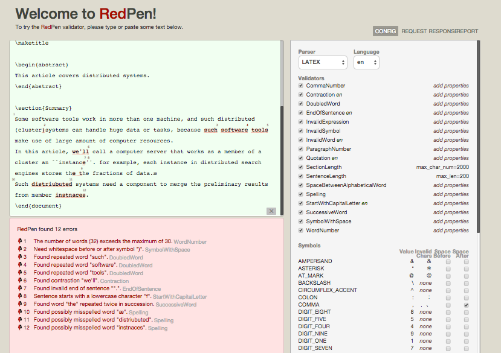

== RedPen コマンド

RedPen は二つのコマンドを提供します。RedPen はコマンドラインツールとサーバコマンドを提供します。

[[command-line-tool]]
=== コマンドラインツール

RedPen が提供するコマンドラインツールは **redpen** という名前です。

[[usage-redpen]]
==== redpen の使い方

以下は、redpen コマンドが提供するオプションです。

[source,bash]
------------------------------------------------
$ redpen [オプション] 入力ファイル（複数可）
------------------------------------------------

複数の入力ファイルを指定した際、ファイル間は半角スペースで区切られます。

[[options]]
==== オプション

redpen コマンドは以下のオプションをサポートしています。

===== RedPen の設定ファイルを指定

----
-c <CONFIG_FILE>, --configuration <CONFIG_FILE>
----

===== 入力フォーマット [**デフォルト**: plain]

----
-f <INPUT_FORMAT>, --input_format <INPUT_FORMAT>
----

以下のフォーマットをサポートします。

[options="header",]
|====
|値       |解説
|plain    |平文
|wiki     |Wiki (Textile) フォーマット
|markdown |Markdown フォーマット
|asciidoc |AsciiDoc フォーマット
|latex    |LaTeX フォーマット
|properties |Java プロパティファイルフォーマット
|====

===== 出力フォーマット [**デフォルト**: plain]

----
option:: -r <RESULT_FORMAT>, --result_format <RESULT_FORMAT>
----

redpen は以下の出力フォーマットをサポートします。

[options="header"]
|====
|値     |解説
|plain  |平文
|plain2 |平文（文ごとのエラーを出力）
|xml    |xml フォーマット
|json   |json フォーマット
|json2  |json フォーマット（文ごとのエラーを出力）
|====

===== 許容するエラー数の指定

redpen コマンドは入力文書に含まれるエラー数が指定された値以下の場合 0 を返します。

----
option:: -l <LIMIT NUMBER>, --limit  <LIMIT NUMBER>
----

===== ヘルプの出力

----
-h, --help
----

===== バージョンの出力
----
--version
----

[[sample-server]]
=== RedPen サーバ

RedPen はサーバ機能を提供します。RedPen はサーバ機能を提供します。RedPen サーバは UI のほかに、REST API も提供します（<<redpen-server>> 節参照）。
以下 RedPen サーバ の UI です。

[[usage-redpen-server]]
==== redpen-server の使い方

RedPen サーバは **redpen-server** コマンドで起動（終了）できます。

[source,bash]
----------------------------
$ redpen-server [start|stop]
----------------------------

[[server-configuration]]
==== 設定

redpen-server の設定は、 redpen-server コマンドファイル自身に記載されています。変更するにはコマンドファイル自身を編集します。
以下が設定できる項目となります。

[options="header",]
|=======================================================================
|設定          |デフォルト値  |解説
|REDPEN_PORT   |8080          |RedPen サーバが利用するポート番号
|STOP_KEY      |redpen.stop   |RedPen サーバはストップキーを登録すると http 経由で終了できます。http 経由で終了させたくない場合にはコメントアウトしてください。
|=======================================================================

サーバが提供する機能については <<redpen-server>> 節を参照してください。
