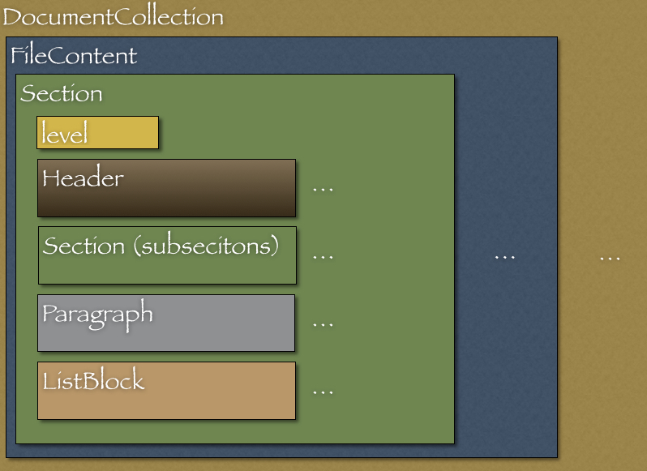

== RedPen を拡張する

ユーザは自身でRedPenを拡張（機能追加）できます。
本節では機能追加の方法とRedPen が内部に保持する文書モデルについて解説します。

機能拡張の作成には抽象クラス（Validato）を実装が必要です。

[[extending-validators]]
=== Validator クラスの拡張

Validatorクラスには実装できるメソッドがいくつか（validate、prevalidate、init）提供されています。
以下各メソッドについて解説します。

[[validate-methods]]
==== validate メソッド

機能を作成するには、かならず*validate*メソッドの実装が必要です。
validate メソッドには引数によっていくつかのバリエーションがあります。
現状では三種類の validate メソッドが提供されています。

[source,java]
----
include::validate-java-interfaces.txt[]
----

Note: 実装されたクラスは特定のパッケージに属す必要があります。利用できるパッケージは*cc.redpen.validator*、*cc.redpen.validator.sentence*、*cc.redpen.validator.section*です。

[[prevalidate-method]]
==== prevalidate メソッド

preValidateはvalidateが呼び出される前に実行されます。preValidateメソッドをvalidateメソッドの前処理として利用すると便利です。
現在、二種類のprevalidteメソッドが提供されています。

[source,java]
----
include::prevalidate-java-interfaces.txt[]
----

[[init-method]]
==== init メソッド

init メソッドは機能（Validator）用の設定項目（プロパティ）を読み込むのに使用します。

[source,java]
----
include::init-java-interfaces.txt[]
----

たとえば *SentencelengthValidator* は *max_len* というプロパティ（設定項目）を提供します。
max_len は入力文書でゆるされる一文の最大長を指定します。以下は文の最大長を二百に指定した設定例となります。

[source,xml]
----
include::load-property-config.xml[]
----

SentenceLengthValidatorはmax_lenの値をinitメソッドで読み込みます。
実際のinit処理は、以下で定義されます。

[source,java]
----
include::init-java-implementation.txt[]
----

上記のコードで、getConfigAttributeAsIntはmax_lenに指定した値をint型としてロードしています。

[[adding-validators]]
=== 作成した Validator の追加

RedPen に作成した Validator を追加する方法は二通りあります。

一つは、機能拡張（Validator）用ファイルを、RedPenのソースに追加してビルドする方法です。
この方法は簡単です。しかし機能拡張用ソースファイルをRedPenのソースファイル群と同梱して扱う必要があります。

もう一つの方法はプラグインを作る方法です。
プラグインの場合には、機能拡張用ファイルをRedPen から独立して扱えます。

Note: どちらの方法でもファイル名に制約があります。ファイル名は語尾（サフィックス）、**Validator**で終わる必要があります。クラス名がValidatorというサフィックスを持たない場合、RedPen は実装された機能ロードできません。
以下、Validatorを追加する方法とプラグインの作り方について解説します。

[[add-a-validator-in-redpen-source]]
==== Validator を RedPen のソースに追加

ではさっそく、簡単なValidator（PlainSentenceLengthValidator）を実装してみましょう。
PlainSentenceLengthValidatorは文書内に存在する文が百文字以上の場合、エラーを出力します。
実装したのち、PlainSentenceLengthValidator を RedPen のソースに追加します。

[[sentencelengthvalidator]]
===== PlainSentenceLengthValidator

PlainSentenceLengthValidatorクラスをパッケージ'cc.redpen.validator.sentence'に作成します。
このときクラスは 'redpen/redpen-core/src/main/java/cc/redpen/validator/sentence/' ディレクトリに保存します。

以下はPlainSentenceLengthValidatorクラスの実装となります。

[source,java]
----
include::plainsentencelengthvalidator.java[]
----

PlainSentenceLengthValidatorはvalidate（引数＝Sentenceオブジェクト）メソッドを実装しています。
PlainSentenceLengthValidatorが設定ファイルに追加されると、RedPenは実装したvaildateメソッドを実行します。
Sentenceが引数なので、RedPenは入力文書の文すべてを引数としてくりかえし実行します。

[[include-a-new-validator]]
===== 実装した Validator を適用する

では設定ファイルに作成した機能を追加しましょう。設定ファイルにはクラス名からサフィックスValidatorをのぞいて追加します。
以下、PlainSentenceLengthValidatorを設定に追加しています。

[source,xml]
----
include::extension-config.xml[]
----

[[create-a-validator-plugin]]
==== プラグインの作成

プラグイン作成でもっとも重要なファイルはpom.xmlです。
pom.xmlはビルドツール、Maven の設定ファイルです。以下は pom.xml の例です。

[source,java]
----
include::redpen-plugin-pom.xml[]
----

プラグインを作るときには上の pom.xml ファイルが**ほぼ**そのまま利用できます。
変更する点は*artifactId*、*name*要素です。あなたの機能名になるよう名前を変更しましょう。

これでpom.xmlが編集できました。編集した機能用のファイルを"main/java/cc/redpen/validator/sentence（sentence）"にコピーします。
上記で解説しましたように、機能用のクラスはValidatorクラスを継承する必要があります。

Validator の実装ファイルをコピーすると、ビルドができます。以下のコマンドでプラグインを作成しましょう。

[source,bash]
----
$ mvn install
----

[[including-a-user-defined-validator-plugin]]
===== 作成したプラグインを利用する

無事mvnコマンドによるビルドが成功しました。これで*target*ディレクトリにプラグイン用jarファイルが生成されます。
プラグイン用jarファイルをRedPenのクラスパスが含まれるディレクトリ（$REDPEN_HOME/libなど）にコピーします。
作成したプラグインが設定ファイルに追加されると、RedPenは実装したvaildateメソッドを実行します。

[[model-structure]]
=== 文書モデル

本節では RedPen が内部に保持する文書モデルについて解説します。
RedPen は多様なテキストフォーマットをサポートします。
各種の入力文書はRedPen内部で**文書モデル**というブロック（クラス）群に変換されます。

生成された内部文書モデルは以下のブロックからなります。

* *Document* 一つ以上の節を持つファイル
* *Section* 文書内の節に相当する。複数のブロック（見出し, パラグラフ, リスト）を保持する。
* *Header* 見出し文
* *Paragraph* パラグラフに相当（複数の文を保持する）
* *ListBlock* リスト要素（ListElement）を保持する

以下のイメージは RedPen が内部で使用する文書モデルです。

